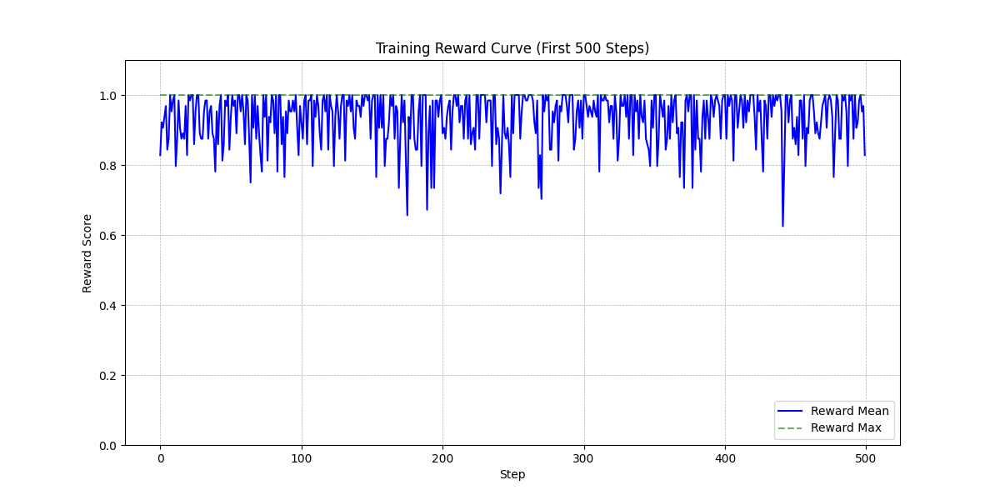

## 一、mindrlhf运行Qwen2.5步骤

（gsm8k，Qwen2.5-7b-instruct）

### 1. 版本对齐

**vllm**

```text
https://repo.mindspore.cn/mirrors/vllm/version/202505/20250514/v0.8.4.dev0_newest/any/vllm-0.8.4.dev0%2Bg296c657.d20250514.empty-py3-none-any.whl
```

**vllm-mindspore**

```text
https://repo.mindspore.cn/mindspore/vllm-mindspore/version/202508/20250807/r0.3.0_20250807104902_4739c2e599777d7790b444ec1fb27573fb941002_newest/ascend/aarch64/

https://repo.mindspore.cn/mindspore/vllm-mindspore/version/202508/20250807/r0.3.0_20250807104902_4739c2e599777d7790b444ec1fb27573fb941002_newest/ascend/aarch64/vllm_mindspore-0.3.0-cp310-cp310-linux_aarch64.whl
```

**msadapter**

```text
https://repo.mindspore.cn/mindspore/msadapter/version/202508/20250807/r0.2.0_20250807013007_e7636d61563c4beafac4b877891172464fdcf321_newest/any/

https://repo.mindspore.cn/mindspore/msadapter/version/202508/20250807/r0.2.0_20250807013007_e7636d61563c4beafac4b877891172464fdcf321_newest/any/msadapter-0.0.1-py3-none-any.whl
```

**mindspore_gs**

```text
https://repo.mindspore.cn/mindspore/golden-stick/version/202506/20250604/master_20250604160014_35fcbec4406d3b18faf02ef99fcbe2741e80348e_newest/any/

https://repo.mindspore.cn/mindspore/golden-stick/version/202506/20250604/master_20250604160014_35fcbec4406d3b18faf02ef99fcbe2741e80348e_newest/any/mindspore_gs-1.2.0.dev20250604-py3-none-any.whl
```

**mindspore**

```text
https://repo.mindspore.cn/mindspore/mindspore/version/202508/20250807/r2.7_20250807154652_7edec76ede691ac90be9590b0ebb2a65923b55fe_newest/unified/aarch64/

https://repo.mindspore.cn/mindspore/mindspore/version/202508/20250807/r2.7_20250807154652_7edec76ede691ac90be9590b0ebb2a65923b55fe_newest/unified/aarch64/mindspore-2.7.0-cp310-cp310-linux_aarch64.whl
```

**mindformers**

```text
git clone https://gitee.com/mindspore/mindformers.git
git checkout 051d65f
```

**cann**

```shell'
cann_8.1.rc1-py_3.10 
所用的notebook镜像为：mindspore_2.6.0rc1-cann_8.1.rc1-py_3.10-euler_2.10.11-aarch64-snt9b
```

**python**

```shell
(MindSpore) [ma-user mindrlhf]$python
Python 3.10.6 | packaged by conda-forge | (main, Aug 22 2022, 20:27:42) [GCC 10.4.0] on linux
Type "help", "copyright", "credits" or "license" for more information.
>>> 
```

**数据集和baseline模型**

```shell
# gsm8k获取链接
git clone https://github.com/openai/grade-school-math.git

# Qwen2.5-7b-instruct
https://www.modelscope.cn/models/qwen/Qwen2.5-7B-Instruct
```


### 2. 操作步骤

#### 2.1 获取源代码

```shell
git clone https://gitee.com/mindspore/mindrlhf.git
bash build.sh


git clone https://gitee.com/mindspore/mindformers.git
cd mindformers
git checkout 051d65f
git rev-parse HEAD  # 用于检查版本  git status
bash build.sh
```


#### 2.2 设置 msprobe 

不然后面会报错：识别不到'save'

```shell
git clone https://gitcode.com/Ascend/mstt.git
cd mstt/debug/accuracy_tools

pip install setuptools wheel

python setup.py bdist_wheel --include-mod=[adump]
cd ./dist
pip install ./mindstudio_probe*.whl
```


#### 2.3 数据集获取和预处理

获取数据集并将其转换为`.mindrecord`格式，这里用的是mindrlhf里面的`rlhf_data.py`程序

```shell
# 获取模型
mkdir models
cd models

pip install modelscope

modelscope download --model Qwen/Qwen2.5-7B-Instruct  --local_dir   /home/ma-user/work/models/Qwen2.5-Instruct

mkdir data
cd data
# 下载gsm8k数据集
git clone https://github.com/openai/grade-school-math.git

# 下载完成后，需要转为MindSpore使用的.mindrecord文件   首先进入MindRLHF路径 并执行以下脚本：
cd mindrlhf

pip install jsonlines

export PYTHONPATH=/home/ma-user/work/mindformers:$PYTHONPATH

python examples/grpo/qwen_grpo_tutorial/rlhf_data.py \
--vocab_path /home/ma-user/work/models/Qwen2.5-Instruct/vocab.json \
--merges_file_path /home/ma-user/work/models/Qwen2.5-Instruct/merges.txt \
--file_path /home/ma-user/work/data/grade-school-math/grade_school_math/data/train.jsonl \
--output_path /home/ma-user/work/data/gsm8k_train.mindrecord \
--dataset_type gsm8k
# 此脚本会将train.jsonl转换成mindrecord的形式保存在/{path}/gsm8k_train.mindrecord。此数据路径将在训练拉起时作为mind_dataset_dir的值被传入。
```


#### 2.4 bash run_grpo_vllm.sh来启动vllm加速

修改`examples/grpo/qwen_grpo_tutorial/run_grpo_vllm.sh`中的配置路径，bash运行即可

```shell
#!/bin/bash

export MS_ALLOC_CONF="memory_tracker:False,enable_vmm:True"
export GLOG_v=2

export vLLM_MODEL_BACKEND=MindFormers
export HCCL_EXEC_TIMEOUT=7200
export MS_JIT_MODULES=vllm_mindspore,research
export MS_ENABLE_LCCL=off

root_path="$(realpath "$(dirname "$0")")"
root_path=$root_path/../../../
cd $root_path
export PYTHONPATH=$root_path:$PYTHONPATH  # define mindrlhf path

export ASCEND_HOME_PATH=/usr/local/Ascend/ascend-toolkit/latest # need modify
export MINDFORMERS_PATH=/home/ma-user/work/mindformers # need modify
export MSADAPTER_PATH=/path/to/msadapter # need modify (msadapter lib path)
export QWEN_MODEL_PATH=/home/ma-user/work/models/Qwen2.5-Instruct
export DATASET_FILE=/home/ma-user/work/data/gsm8k_train.mindrecord
export SAVE_CHECKPOINT_DIR=/home/ma-user/work/mindrlhf/output/grpo_checkpoints

export PYTHONPATH=$MSADAPTER_PATH:$MINDFORMERS_PATH:$PYTHONPATH

msrun --worker_num=8 --local_worker_num=8 \
--master_addr=127.0.0.1 --master_port=9887 \
--join=True --log_dir=./prof_vllm_log \
examples/grpo/qwen_grpo_tutorial/main.py \
--config examples/grpo/qwen_grpo_tutorial/grpo_config.yaml \
--tokenizer_dir $QWEN_MODEL_PATH \
--dataset_file $DATASET_FILE \
--save_checkpoint_dir $SAVE_CHECKPOINT_DIR \
--actor_checkpoint_path $QWEN_MODEL_PATH \
--ref_checkpoint_path $QWEN_MODEL_PATH \
--generate_checkpoint_path $QWEN_MODEL_PATH \
--verifier_function "qwen_accuracy_reward,format_reward" \
--verifier_weight "1.0,1.0" > vllm.log 2>&1 &
```

### 3. baseline结果

**reward曲线**




## 附录

### 附录1. 一键配置环境脚本

在`work`目录下 下载好包的.whl文件后，bash即可

```shell
pip install vllm-0.8.4.dev0+g296c657.d20250514.empty-py3-none-any.whl

pip3 uninstall torch torch-npu torchvision

pip install vllm_mindspore-0.3.0-cp310-cp310-linux_aarch64.whl

pip install msadapter-0.0.1-py3-none-any.whl

pip install mindspore_gs-1.2.0.dev20250604-py3-none-any.whl

pip install mindspore-2.7.0-cp310-cp310-linux_aarch64.whl

pip install ray


# 解决一直遇到的bug
pip install --upgrade 'urllib3==1.26.7' 

# 安装mindformers
cd mindformers
git checkout 051d65f
bash build.sh

# 安装mindrlhf
cd ../mindrlhf
bash build.sh

# 安装mindstudio_probe 避免'save'报错

cd ../ #回到work目录下
git clone https://gitcode.com/Ascend/mstt.git

cd mstt/debug/accuracy_tools

pip install setuptools wheel

python setup.py bdist_wheel --include-mod=[adump]
cd ./dist
pip install ./mindstudio_probe*.whl
```


### 附录2 grpo_config.yaml

```yaml
# RL config
rl_config:
  model_name: 'qwen2.5'
  deterministic: "OFF"
  align_type: 'rlhf_stages'
  dataset_file: "/path/train.mindrecord"
  tokenizer_type: 'qwen'
  tokenizer_dir: "/path/"
  epochs: 10
  batch_size: 1
  sink_size: 1
  seq_length: 8192
  use_parallel: True
  load_ckpt_format: "hf_safetensors"
  parallel_mode: "semi_auto_parallel"
  enable_compile_cache: False
  save_strategy_dir: "./strategy/"  # need to be set
  save_data_file: "/tmp/grpo.mindrecord"

  packing: True
  pack_num: 1

  save_prompt_completions_data: True
  save_prompt_completions_interval: 1
  save_prompt_completions_dir: "/tmp/"

  reshard_mem_opt_level: 0
  save_ckpt_interval: 5
  save_max_ckpt_num: 5
  save_ckpt_format: "safetensors" # format support safetensors/ckpt
  enable_reshard_optimizer: False

  tensorboard: False
  tensorboard_dir: '/tmp/'
  tensorboard_queue_size: 10

  performance_stats: true
  micro_batch_interleaved: 1

  beta: 0.01 # KL coefficient
  num_generations: 8
  num_rollouts: 4
  chunk_size: 1
  gen_experience_kwargs: False
  # clip higher
  num_iterations: 1
  epsilon_low: 0.2
  epsilon_high: 0.2
  enable_oldpolicy: True
  seed: 0


monitor_config:
  host_monitor_interval: -1.0
  host_monitor_steps: [ ]
  host_memory_protection: False
  host_max_memory_threshold: 0.95

# actor model config
actor_config:
  load: ""
  save: "/tmp/"
  model_config: "./model_configs/qwen_grpo/qwen2_5_7b/finetune_qwen2_5_7b.yaml"  # need to be set
  enable_alltoall: False
  offset: 0
  use_eod_attn_mask_compression: True
  loss_scale_value: 1
  parallel_config:
    data_parallel: 1  # need to be set
    model_parallel: 4  # need to be set
    pipeline_stage: 2  # need to be set
    use_seq_parallel: False
    micro_batch_num: 2
    vocab_emb_dp: False
    context_parallel: 1
  recompute_config:
    recompute: True
    select_recompute: False
  enable_parallel_optimizer: True

  optimizer:
    type: 'adamw'
    adam_beta1: 0.9
    adam_beta2: 0.95
    eps: 1.0e-8
    weight_decay: 0.01
    opt_offload: False

  lr_schedule:
    lr_decay_style: 'cosine'
    lr: 5.0e-7
    min_lr: 1.0e-10
    warmup_step: 10
    decay_steps: 200000


# reference model config
ref_config:
  model_config: "./model_configs/qwen_grpo/qwen2_5_7b/finetune_qwen2_5_7b.yaml"  # need to be set
  load: ""
  ref_model_batch_size: 2
  offset: 0
  use_eod_attn_mask_compression: True
  # Whether to synchronize the reference model with the actor model every `ref_model_sync_steps`"
  sync_ref_model: False
  ref_model_sync_steps: 50

  parallel_config:
    data_parallel: 2  # need to be set
    model_parallel: 4  # need to be set
    pipeline_stage: 1  # need to be set
    context_parallel: 1


# reward config
reward_config:
  verifier_function: ["accuracy_reward", "format_reward"]
  verifier_weight: [1.0, 1.0]


# generate config
generate_config:
  model_config: "./model_configs/qwen_grpo/qwen2_5_7b/predict_qwen2_5_7b_instruct.yaml"  # need to be set
  load: ""
  infer_model_batch_size: 2

  parallel_config:
    data_parallel: 2  # need to be set
    model_parallel: 4  # need to be set
    pipeline_stage: 1  # need to be set
    context_parallel: 1

  use_vllm: 1  # 0--MindFormers; 1--VLLM; 2--DEBUG mode; init model with vllm, but generate with mindformers
  hf_config_path: "./config.json"   # vllm config path
  block_size: 16
  max_model_len: 32768
  max_num_batched_tokens: 32768
  max_num_seqs: 1024
  max_prompt_length: 2048
  num_scheduler_steps: 32
  gpu_memory_utilization: 0.7

  sampling_config:
    max_tokens: 512  # max_decode_length
    min_tokens: 2  # min_decode_length
    temperature: 0.8
    repetition_penalty: 1.05
    top_p: 0.8
    top_k: 20
    bos_token_id: 151643
    eos_token_id: [151645, 151643]
    pad_token_id: 151643
    detokenize: False


# context
context:
  mode: 0 # 0--Graph Mode; 1--Pynative Mode
  device_target: "Ascend"
  max_call_depth: 10000
  max_device_memory: "58GB"
  save_graphs: False
  save_graphs_path: "./graph/"
  device_id: 0
  jit_config:
    jit_level: "O0"
  memory_optimize_level: "O0"
  ascend_config:
    precision_mode: "must_keep_origin_dtype"


# profiler config
profiler_config:
  profile: false
  mstx: false
  stage: all
  profile_save_path: ./profiler_data
  profile_step_start: 0
  profile_step_end: 1
  profile_level: level1
  profile_with_memory: false
  profile_with_cpu: true
  profile_with_npu: true
  profile_with_stack: false
  profile_analysis: false
  profile_ranks: all

# msprobe config
msprobe_config:
  msprobe: true
  dump_path: "./msprobe_dump"
  key_data_dump: true
  configurations_dump: true
```


```
1. 实验环境与模型设定 (Experimental Setup)
Base Model: Qwen2.5-7B
Actor Model: MP=4 + (PP=2
Ref/Infer Model: DP=2 + MP=4

上下文长度 (Context): 序列长度 8192，生成长度限制 512
2. 核心训练参数 (Core Hyperparameters)
算法策略: GRPO (Group Relative Policy Optimization)
单提示采样数 (Generations per Prompt): 8 (即 Group Size = 8)

Rollout 次数: 4

3. 奖励与评估机制 (Reward & Verification)
奖励函数 (Verifier Function): 规则式奖励 (Rule-based)
Accuracy Reward: 权重 1.0 (准确性)
Format Reward: 权重 1.0 (格式规范性)
生成参数 (Inference Params):
Temperature: 0.8
Top-P: 0.8 / Top-K: 20

```


