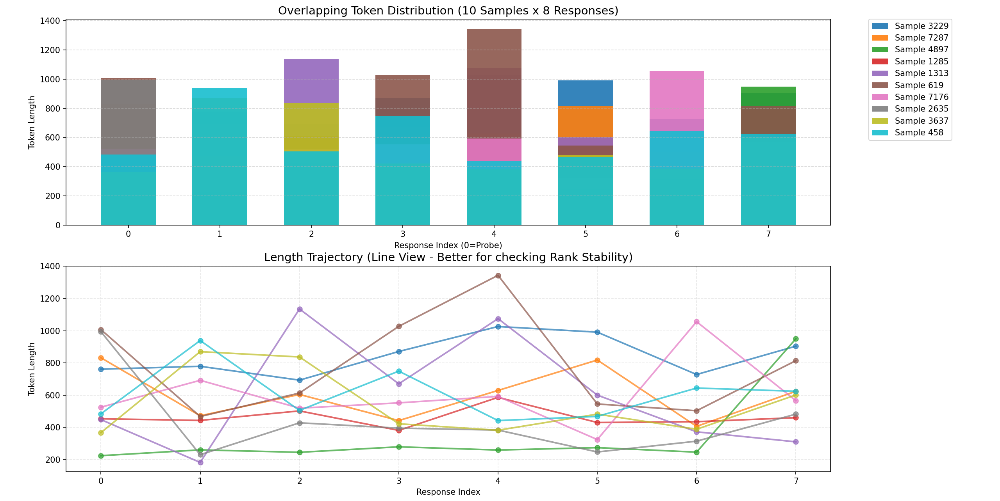
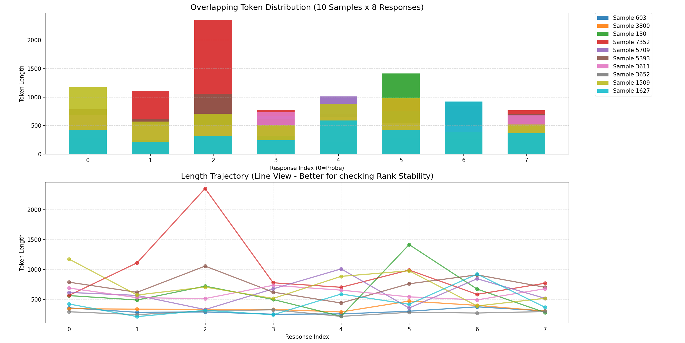
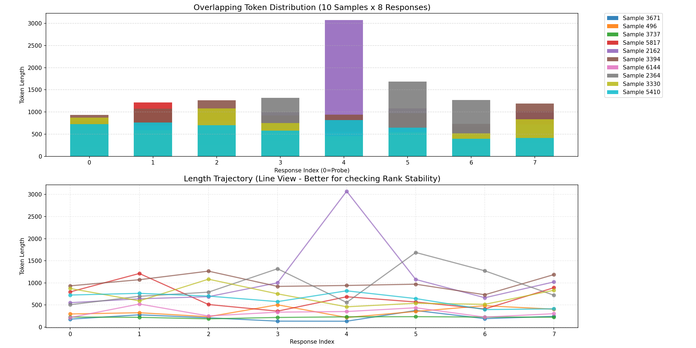
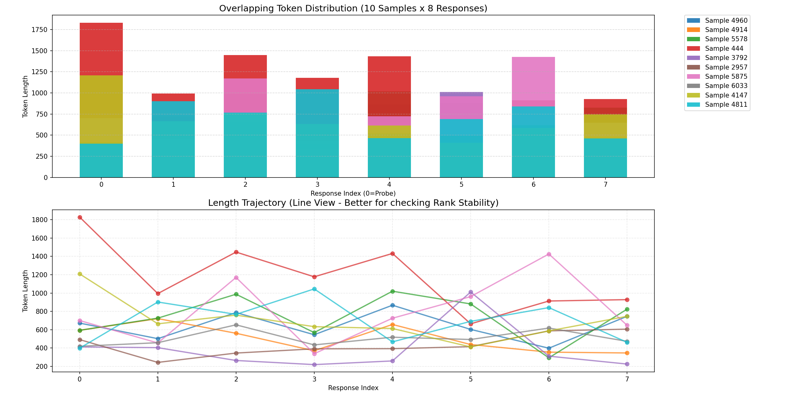

**规模**：58 Batches / 共计 7424 样本（MATH 数据集）。

**并行度**：每个 Prompt 采样（Rollout）8 次；Batch Size 为 128。

**阈值**：以首个回答长度排序，Top 20% 判定为“长尾”，Fast Worker 熔断阈值为长尾长度的 1.5 倍。

**结果：**

分析了 58 个 Batch，共 7424 个样本

[任务分发详情]

  - Heavy Worker (初始分配):  1450  (19.5%)

  - Fast Worker  (初始分配):  5974  (80.5%)

      ​	|-- 成功执行:           5197  (87.0%)

      ​	|-- 熔断重试 (Retry):   777   (13.0%)


整体思路

因为GRPO对同一个样本推理n次

前提：同一个prompt rollout的长度大致相同

对同一个batch里面的所有samples，先推理一次，计算出时间/token长度，然后依据时间/token对samples进行排序，划分出长尾sample和普通sample。

但现在有个问题，同一个prompt 推理n次得到的responses，他们的token长度方差挺大的。


首先，所有 Worker 并行对 Batch 内样本进行单次探路 (Probe)；随后，依据探路长度排序，将 Top 20%的显性长任务直接转移 (Offload) 至 Heavy Worker；剩余 80% 的任务留在 Fast Worker 原地执行，但需设置 动态熔断阈值（Probe 长度的 1.5 倍）；若极少数任务（约13%）在执行中突破该阈值，则触发熔断并回流至 Heavy Worker 重跑。此策略以微小的重试代价（~5% 算力损耗），换取了 Fast Worker 显存压力的彻底释放，使其支持 2倍 Batch Size并发，从而预期实现 20% 以上 的整体时间节省。


```
python3 examples/data_preprocess/math_dataset.py --local_dir "data/math" --data_path "DigitalLearningGmbH/MATH-lighteval"
```


# 思路演进

 P-DSR 方案演进与验证路径 (论文思路梳理)

    1. 问题发现 (Problem Identification)

   * 背景：在 GRPO 强化学习训练中，推理（Rollout）阶段占据了大量时间。
   * 现象：推理过程中存在显著的 "Bubble" (空转) 现象。
   * 根因假设：推测是由于 Generation Length 的长尾分布 导致的。即：同一个 Batch 中，少数几个超长回答（Long-tail）拖慢了整体进度，且占用了大量显存，导致 Batch Size 无法提升。

    2. 初始方案 V1 (Batch-Sync Probe)

   * 思路：既然长短不一，那就先跑一次（Probe），预测出哪些是长任务，把它们分流走。
   * 假设：同一个 Prompt 的 $N$ 次回答，长度应该是 "大差不差" (Consistent) 的。

    3. 数据验证与假设推翻 (Empirical Analysis)
       为了验证 V1，我们在 0.5B 模型 + MATH 数据集上进行了实验数据采集（Log Collection）。

   * 发现 1：高方差 (High Variance)
     * 通过 analyze_variance 发现，CV (变异系数) 平均值达 0.29，最大达 1.18。说明模型输出极其不稳定。
   * 发现 2：预测失效 (Prediction Failure)
     * False Negative (漏斗率) 极高：Probe < 512 的样本中，有 63% 的概率后续会爆出 > 512 的长尾。
     * 结论：静态预测不可靠。如果按 V1 执行，Fast Worker 会被“隐形刺客”击穿，导致 OOM 或阻塞。

    4. 方案迭代 V2 (Circuit Breaker)

   * 思路调整：既然无法完美预测，就必须接受错误。引入 "软熔断 (Soft Circuit Breaker)" 机制。
   * 策略：允许分流错误，但在 Fast Worker 上设置 max_tokens 锁。一旦触网，立刻截断并重试（Retry）。
   * 新问题：如果阈值设死（如 512），重试率太高（63%），导致算力浪费严重，可能得不偿失。

    5. 最终方案 V2.5 (Dynamic Rank-Based Offloading)

   * 思路升级：从“绝对阈值”转向 "相对排名 (Percentile)"，以适应不同 Batch 的难度波动。
   * 策略：
     1. Probe & Sort：按长度排序。
     2. Top 20% Offload：移走最长的 20%（数据证明 Top 端的预测准确率高达 97%）。
     3. Dynamic Cap：利用 Top 20% 的分界线长度 $L_{cut}$，动态设定 Fast Worker 的熔断线为 $1.5 \times L_{cut}$。
   * 仿真验证 (Simulation)：
     * 利用真实 Log 数据回测该策略。
     * 结果：Failure Rate (重试率) 骤降至 13%。
     * 意义：证明了该方案在保证系统稳定性的前提下，将额外开销控制在了极低水平（<10% 算力损耗），从而为通过增大 Batch Size 换取 20% 时间提升提供了坚实的理论基础。

---

  论文写作建议：
  你可以按照 "Motivation (长尾导致效率低) -> Observation (数据揭示高方差与预测难点) -> Method (提出动态排名+熔断机制) -> Evaluation (仿真证明低重试率与高收益)"
  的逻辑线来组织内容。这样显得非常严谨且由于数据支撑而具有说服力。


```shell
F:\Code\Environment\EntPython\Anaconda3_envs\envs\gpu_test01\python.exe F:/Desktop/work/相关性分析.py
正在读取文件: rollout_length_stats_sync_0.5b.jsonl ...
成功加载 7424 条 Prompt 组数据。
------------------------------
【第 0 次 Rollout 与其他各次 Rollout 的排序相关性】
(1.0 表示完全一致，0 表示无关，-1 表示完全相反)
Rollout_0    1.000000
Rollout_1    0.617016
Rollout_2    0.630700
Rollout_3    0.622318
Rollout_4    0.624004
Rollout_5    0.632354
Rollout_6    0.625151
Rollout_7    0.607546
Name: Rollout_0, dtype: float64
------------------------------
平均相关系数: 0.6699

Process finished with exit code 0

```


```shell
F:\Code\Environment\EntPython\Anaconda3_envs\envs\gpu_test01\python.exe F:/Desktop/work/top-k.py
数据加载完成: 7424 组
【长尾分析】 关注最长的前 10.0% (即 Top 742 个样本)
--------------------------------------------------
| Rollout ID   | Recall (召回率)    | 说明
--------------------------------------------------
| Rollout_1    | 30.46%          | 在 R0 认为是长尾的样本，30% 概率在 R1 也是长尾
| Rollout_2    | 32.61%          | 在 R0 认为是长尾的样本，33% 概率在 R2 也是长尾
| Rollout_3    | 29.65%          | 在 R0 认为是长尾的样本，30% 概率在 R3 也是长尾
| Rollout_4    | 31.67%          | 在 R0 认为是长尾的样本，32% 概率在 R4 也是长尾
| Rollout_5    | 31.27%          | 在 R0 认为是长尾的样本，31% 概率在 R5 也是长尾
| Rollout_6    | 28.84%          | 在 R0 认为是长尾的样本，29% 概率在 R6 也是长尾
| Rollout_7    | 30.46%          | 在 R0 认为是长尾的样本，30% 概率在 R7 也是长尾
--------------------------------------------------
平均长尾召回率: 30.71%

【容错分析】 R0 预测为 Top 10%，实际落入 Top 20% 的比例 (安全调度比例)
平均安全调度率: 51.14%

Process finished with exit code 0

```


```she

F:\Code\Environment\EntPython\Anaconda3_envs\envs\gpu_test01\python.exe F:/Desktop/work/误判.py
数据总量: 7424 个 Prompt 组
模拟 Batch 数量: 464 (每个Batch含 16 个Prompt)

========================================
【Batch 级 破坏性测试结果】
定义：能够识别出 Batch 中最长任务即为成功 (容忍度 Top-3)
========================================
1. Batch 最长任务捕获率: 46.98%
   (意味着 53.02% 的 Batch 会因为漏判长任务而发生阻塞)

2. 漏判严重程度 (Cost Ratio):
   平均倍数: 4.67x (Probe 认为是100，实际跑了 467)
   最大倍数: 68.36x

Process finished with exit code 0

```












